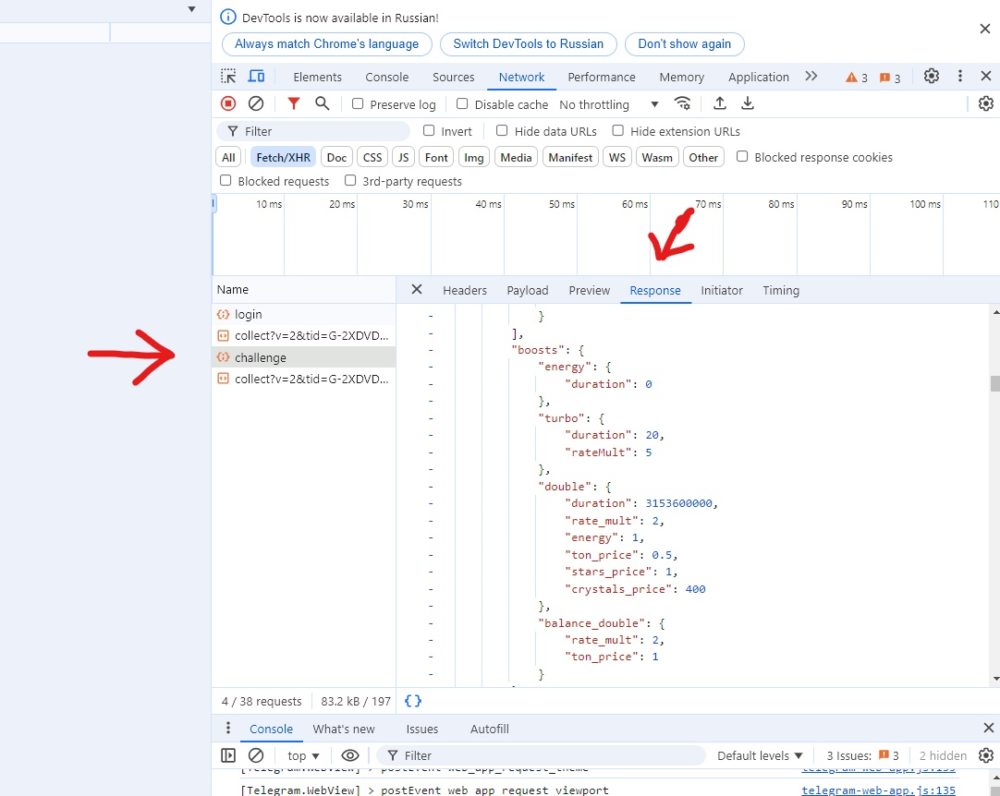

# A script that will click and farm Tapswap tokens for you, using your boosts

## Usage

1. Install Node.js and npm if you haven't already
2. Clone the repository
3. Open Tapswap in Web Telegram.

### Automating the Process

1. Open Developer Tools in your browser.
2. Go to the Network tab.
3. Find and load the response from https://api.tapswap.club/api/account/challenge.

4. Save the response into the ./response.json file.
5. Than open `Console` tab and find `[AppContext] buildNum` and paste its value into the `./src/tapswap.js` file at:   `const headers = {..., "x-cv": "<buildNum>", ... };`.   For example, if your `[AppContext] buildNum` is 652, the line would look like this:   `const headers = {..., "x-cv": "652", ... };`

6. Run the script by running `npm install` and `npm start`.

Now the process is automated. And you can easily mine tokens.

# Happy mining!

---

# Скрипт для кликов и фарма токенов Tapswap с использованием ваших бустов

## Использование

1. Установите Node.js и npm, если они еще не установлены.
2. Клонируйте репозиторий.
3. Откройте Tapswap в Web Телеграм.

### Автоматизация процесса

1. Откройте Инструменты разработчика в браузере.
2. Перейдите на вкладку Network.
3. Найдите и загрузите ответ от https://api.tapswap.club/api/account/challenge.

4. Сохраните ответ в файл `./response.json`.
5. Затем откройте вкладку `Console` и найдите `[AppContext] buildNum`. Вставьте его значение в файл `./src/tapswap.js` в строку:   `const headers = {..., "x-cv": "<buildNum>", ... };`.   Например, если ваш `[AppContext] buildNum` равен 652, строка будет выглядеть так:   `const headers = {..., "x-cv": "652", ... };`

6. Запустите скрипт, выполнив команды `npm install` и `npm start`.

Теперь процесс автоматизирован, и вы можете легко майнить токены.

## Удачного майнинга!
